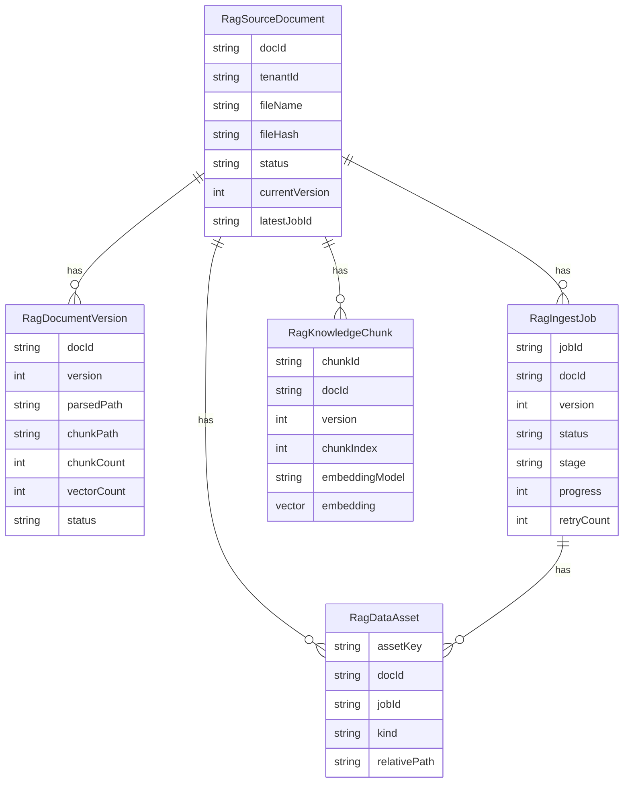
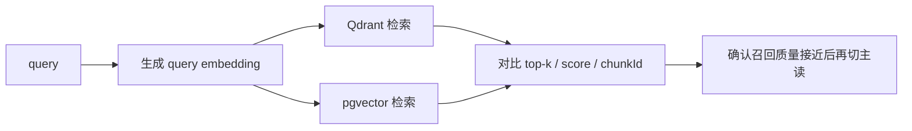

# PostgreSQL / pgvector 迁移分析与项目现状说明

最后核对时间：2026-03-23

这份文档不再只回答“理论上应该怎么迁”，而是回答下面 4 个更具体的问题：

1. 这个仓库当前真实的在线链路是什么
2. PostgreSQL / pgvector 已经迁到了哪一步
3. 哪些数据已经在 PostgreSQL，哪些还只是 Qdrant 或本地文件
4. 如果后续要正式切到 pgvector 检索，还缺哪几个明确动作

本文结论基于三类事实源：

- 代码：`backend/app/services/*.py`、`backend/app/tools/*.py`、`backend/app/db/*.py`
- Schema：`prisma/schema.prisma`
- 2026-03-23 实测 PostgreSQL 快照与 `data/` 目录快照

---

## 1. 一句话结论

当前项目已经不是“只有 JSON + Qdrant”的 demo 形态了，但也还没有真正切成“PostgreSQL / pgvector 在线主检索”。

现在的真实状态是：

- 在线元数据真源可以切到 PostgreSQL
  - `rag_source_documents`
  - `rag_ingest_jobs`
- 在线向量检索主链路仍然是 Qdrant
- `rag_document_versions` / `rag_knowledge_chunks` / `rag_data_assets` / `embedding vector(1024)` 已经通过补数脚本迁进 PostgreSQL
- 但在线 ingest 代码还没有把这些表作为实时写入目标

换句话说：

- **数据已经迁了大半**
- **在线检索还没切**
- **在线写入链路还没有彻底改成“边 ingest 边写 PostgreSQL chunk/vector”**

---

## 2. 先把当前架构画清楚

### 2.1 当前真实链路图

```mermaid
flowchart TD
    A[前端 / Swagger / API 调用] --> B[FastAPI DocumentService]
    B --> C[保存 uploads 原始文件]
    B --> D[写 document/job 元数据]
    D --> D1[data/documents + data/jobs]
    D --> D2[PostgreSQL rag_source_documents + rag_ingest_jobs]

    B --> E[DocumentIngestionService]
    E --> F[DocumentParser]
    F --> G[data/parsed/*.txt]
    E --> H[TextChunker]
    H --> I[data/chunks/*.json]
    E --> J[EmbeddingClient]
    J --> K[QdrantVectorStore]
    K --> L[Qdrant collection]

    M[scripts/backfill_postgres_data.py] --> N[rag_document_versions]
    M --> O[rag_knowledge_chunks 内容与元数据]
    M --> P[rag_data_assets]

    Q[scripts/backfill_pgvector_embeddings.py] --> R[Qdrant 取旧向量 / 或重新 embedding]
    R --> S[rag_knowledge_chunks.embedding vector(1024)]

    T[RetrievalService] --> U[EmbeddingClient(query)]
    U --> V[Qdrant search]
    V --> W[返回检索结果]
```

### 2.2 这张图真正说明了什么

这张图里最重要的点不是“PostgreSQL 已经出现了”，而是**PostgreSQL 出现在哪条链路里**。

当前分成两条不同性质的链路：

- 在线主链路
  - 上传
  - 解析
  - chunk
  - embedding
  - Qdrant 写入
  - Qdrant 检索
- 迁移 / 补数链路
  - 把 `data/` 目录镜像进 PostgreSQL
  - 把 `rag_knowledge_chunks.embedding` 补齐成 pgvector

所以现在更准确的描述不是“项目已经全面切换到 PostgreSQL / pgvector”，而是：

- **PostgreSQL 已经有结构化副本和向量副本**
- **在线请求默认仍然依赖 Qdrant**

---

## 3. 代码里到底是怎么写的

### 3.1 `DocumentService` 只把 metadata 切到 PostgreSQL

当前在线写 PostgreSQL 的入口在：

- `backend/app/services/document_service.py`
- `backend/app/db/postgres_metadata_store.py`

这里的关键行为是：

- 开启 `RAG_POSTGRES_METADATA_ENABLED=true` 后
- `DocumentService` 初始化 `PostgresMetadataStore`
- 在线请求只会写：
  - `rag_source_documents`
  - `rag_ingest_jobs`

它不会在在线 ingest 时直接写：

- `rag_document_versions`
- `rag_knowledge_chunks`
- `rag_data_assets`

这件事非常关键，因为它解释了为什么数据库里会出现：

- `document/job` 记录数量比 `version/chunk` 多得多

### 3.2 `DocumentIngestionService` 仍然写本地文件 + Qdrant

当前在线 ingest 代码在：

- `backend/app/services/ingestion_service.py`

它的真实执行顺序是：

1. 解析原始文件
2. 写 `data/parsed/{document_id}.txt`
3. 切 chunk
4. 写 `data/chunks/{document_id}.json`
5. 调 embedding
6. 调 `QdrantVectorStore.upsert_document(...)`

也就是说，在线 ingest 目前的结果是：

- 本地磁盘里有 parsed/chunk 文件
- Qdrant 里有在线检索需要的向量

但这一步本身**不会自动写 PostgreSQL chunk 表**。

### 3.3 `RetrievalService` 现在是硬编码走 Qdrant

当前检索代码在：

- `backend/app/services/retrieval_service.py`

这里的事实很直接：

- 查询时先做 query embedding
- 然后直接调用 `QdrantVectorStore.search(...)`
- 返回的 `mode` 固定是 `"qdrant"`

因此只要 `RetrievalService` 还没有改写，项目对外的真实检索引擎就仍然是 Qdrant。

---

## 4. 为什么 legacy `KnowledgeDocument` 不能直接顶上

`prisma/schema.prisma` 里保留了 legacy 表：

```prisma
model KnowledgeDocument {
  id        String   @id @default(uuid())
  filename  String
  namespace String   @default("default")
  content   String   @db.Text
  embedding Unsupported("vector(1536)")?
  metadata  Json?
  createdAt DateTime @default(now())
}
```

它不能直接承担当前项目主存储职责，原因不是抽象的“架构不优雅”，而是几个具体硬约束：

1. 向量维度不匹配  
   当前项目 embedding 模型是 `BAAI/bge-m3`，实际维度是 `1024`，不是 `1536`。

2. 它没有文档主表 / 任务表 / 版本表拆分  
   当前项目的数据不是“一个文档 = 一行向量记录”，而是：
   - 文档主记录
   - 版本记录
   - ingest job
   - 多条 chunk

3. 它没有当前项目实际在用的治理字段  
   当前 schema 已经围绕这些字段建模：
   - `tenantId`
   - `visibility`
   - `classification`
   - `departmentIds`
   - `roleIds`
   - `ownerId`
   - `currentVersion`
   - `latestJobId`
   - `fileHash`

4. 它不适合承接“文档主数据 + 生命周期”  
   `KnowledgeDocument` 更像 demo 级 chunk 表，不是企业级 RAG 的主数据模型。

所以当前项目的正确方向不是“硬改 `KnowledgeDocument`”，而是保留 legacy 表不动，在旁边新增当前项目专用表。

---

## 5. 当前 PostgreSQL 表设计到底各自干什么

### 5.1 表角色总览

| 表名 | 当前角色 | 是否在线主链路实时写入 | 是否已落地 |
| --- | --- | --- | --- |
| `rag_source_documents` | 文档主数据 | 是 | 是 |
| `rag_ingest_jobs` | ingest 任务状态 | 是 | 是 |
| `rag_document_versions` | 文档版本快照 | 否，当前靠 backfill | 是 |
| `rag_knowledge_chunks` | chunk 文本与 ACL 元数据 | 否，当前靠 backfill | 是 |
| `rag_knowledge_chunks.embedding` | pgvector 向量列 | 否，当前靠 backfill | 是 |
| `rag_data_assets` | `data/` 文件镜像 | 否，当前靠 backfill | 是 |

### 5.2 表关系图



### 5.3 pgvector 这部分不是“纸上设计”，数据库里已经在

实测 PostgreSQL 当前已经具备：

- `vector` extension 已安装
- `rag_knowledge_chunks.embedding` 已落地
- HNSW ANN 索引已存在：
  - `rag_knowledge_chunks_embedding_hnsw_idx`

这意味着：

- schema 层面已经具备 pgvector 检索能力
- 后续切检索不是“先建库”，而是“改在线读取路径”

---

## 6. 2026-03-23 当前项目快照

这一节最重要，因为它回答的是“现在库里到底是什么样”。

### 6.1 `data/` 目录快照

以非隐藏文件为准，当前 `data/` 实际包含：

| 目录 | 文件数 | 说明 |
| --- | ---: | --- |
| `data/documents` | 5 | 文档 metadata JSON |
| `data/jobs` | 5 | 任务 metadata JSON |
| `data/parsed` | 4 | 解析文本文件 |
| `data/chunks` | 4 | chunk JSON |
| `data/uploads` | 12 | 原始上传文件 |

这里 `parsed/chunks/uploads` 目录里都还有 `.gitkeep`，所以如果你直接数“所有文件”，会多出 1 个。这也是为什么有时你会看到 `5/5/13` 这种数。

### 6.2 PostgreSQL 表总量

实测当前 PostgreSQL 记录数如下：

| 表名 | 当前行数 |
| --- | ---: |
| `rag_source_documents` | 17 |
| `rag_ingest_jobs` | 17 |
| `rag_document_versions` | 5 |
| `rag_knowledge_chunks` | 557 |
| `rag_data_assets` | 30 |

### 6.3 这些数字为什么不是一一对应

这里最容易误解的是：

- 为什么 `documents/jobs` 是 `17/17`
- 但 `versions` 只有 `5`
- `chunks` 只有 `557`

原因不是“数据坏了”，而是**两条链路写入范围不同**：

1. 在线上传 / 创建任务  
   当前只稳定写：
   - `rag_source_documents`
   - `rag_ingest_jobs`

2. `version/chunk/assets/vector`  
   当前主要由 backfill 脚本补齐，不是在线 ingest 自动维护

所以多出来的 `12` 条 document/job，本质上是：

- 在线创建出来的 metadata 记录
- 但还没有同步补齐到 `version/chunk/vector/assets` 这一层

### 6.4 当前 document / job 状态分布

当前状态分布如下：

| 维度 | 状态 | 数量 |
| --- | --- | ---: |
| document | `queued` | 12 |
| document | `active` | 3 |
| document | `failed` | 2 |
| job | `queued` | 12 |
| job | `completed` | 3 |
| job | `dead_letter` | 2 |

这组数字和上面的判断是能对上的：

- `3 active + 2 failed = 5`  
  这 5 条正好对应当前有版本记录的那批文档
- 另外 `12 queued`  
  说明还有 12 条在线 metadata 记录没有进一步落到 version/chunk 层

### 6.5 版本表当前明细

当前 `rag_document_versions` 里实际只有 5 条：

| docId | version | chunkCount | vectorCount | status | parsedPath | chunkPath |
| --- | ---: | ---: | ---: | --- | --- | --- |
| `doc_20260321023926_5221d730` | 1 | 492 | 492 | `active` | 有 | 有 |
| `doc_20260321051036_1eb6b16f` | 1 | 13 | 13 | `active` | 有 | 有 |
| `doc_20260321070337_445684f4` | 1 | 52 | 52 | `active` | 有 | 有 |
| `doc_20260321065116_23c3ed8b` | 1 | 0 | 0 | `failed` | 无 | 无 |
| `doc_20260321065953_a5d97284` | 1 | 0 | 0 | `failed` | 无 | 无 |

从这里能看出两件事：

1. 当前真正完成向量化并可迁到 pgvector 的在线文档只有 3 个
2. 失败任务已经在版本表里占位，但因为没有 parsed/chunk 产物，所以 `chunkCount/vectorCount` 都是 0

### 6.6 `rag_knowledge_chunks` 当前状态

实测：

- 总 chunk 数：`557`
- `embedding IS NULL`：`0`
- `embedding IS NOT NULL`：`557`
- `rag_document_versions.vectorCount` 求和：`557`

这说明 pgvector 这一层已经是完整的，不是半迁移状态。

### 6.7 `rag_data_assets` 当前状态

当前资产分布如下：

| kind | 数量 | 能回链到 `docId` 的数量 |
| --- | ---: | ---: |
| `document_json` | 5 | 5 |
| `job_json` | 5 | 5 |
| `parsed_text` | 4 | 3 |
| `chunk_json` | 4 | 3 |
| `upload_file` | 12 | 5 |

这里的几个细节非常值得注意：

1. `parsed_text` 和 `chunk_json` 只有 3 行能回链到 `docId`  
   因为磁盘里还存在：
   - `data/parsed/debug-doc.txt`
   - `data/chunks/debug-doc.json`

   这两份文件会被当作资产镜像入库，但它们不对应正式 document record。

2. `upload_file` 有 12 行，但只有 5 行能回链到 `docId`  
   说明历史 uploads 文件命名并不都满足当前的 docId 反推规则。  
   也就是说，`rag_data_assets` 已经能作为文件镜像仓，但还不是 100% 完整的“资产-文档关系表”。

3. `rag_data_assets = 30` 与当前 `data/` 快照完全对得上  
   即：
   - `5 documents`
   - `5 jobs`
   - `4 parsed`
   - `4 chunks`
   - `12 uploads`

### 6.8 `rag_data_assets` 是否真的存了文件内容

当前实测：

- `binaryContent IS NOT NULL = 30`
- `textContent IS NOT NULL = 27`

这说明当前这 30 条资产行并不只是登记了路径和 hash，绝大多数文件内容本身也已经进了 PostgreSQL。

---

## 7. 当前迁移脚本分别负责什么

### 7.1 `scripts/backfill_postgres_metadata.py`

职责：

- 扫 `data/documents/*.json`
- 扫 `data/jobs/*.json`
- upsert 到：
  - `rag_source_documents`
  - `rag_ingest_jobs`

它对应的是“metadata 级别补数”，不负责版本、chunk、资产、向量。

### 7.2 `scripts/backfill_postgres_data.py`

职责：

- 以 `data/` 目录为输入
- 生成并写入：
  - `rag_source_documents`
  - `rag_ingest_jobs`
  - `rag_document_versions`
  - `rag_knowledge_chunks`
  - `rag_data_assets`

这个脚本是真正把“磁盘上的项目状态”镜像到 PostgreSQL 的主入口。

它的关键逻辑在：

- `backend/app/tools/postgres_data_backfill.py`

里面做了三件重要事情：

1. `build_document_version_rows(...)`  
   根据 document metadata + parsed/chunk 文件推导版本行

2. `build_chunk_rows(...)`  
   把 `data/chunks/*.json` 转成 `rag_knowledge_chunks` 行

3. `iter_asset_rows(...)`  
   递归扫描 `data/`，把所有文件转成 `rag_data_assets`

### 7.3 `scripts/backfill_pgvector_embeddings.py`

职责：

- 给 `rag_knowledge_chunks.embedding` 补齐向量

它支持三种模式：

- `qdrant`
- `reembed`
- `hybrid`

默认推荐 `hybrid`，因为它先利用已存在的 Qdrant 向量，再对缺失部分重算 embedding。

### 7.4 这个脚本还顺手做了什么

`backend/app/tools/pgvector_backfill.py` 在非 dry-run 时还会：

1. 检查 `public.rag_knowledge_chunks` 是否存在
2. 确保 `vector` extension 已可用
3. 尝试创建 ANN 索引
   - 优先 `hnsw`
   - 失败再回退 `ivfflat`
4. 把 `rag_document_versions.vectorCount` 同步为真实向量数

也就是说，这个脚本不只是“补 embedding 值”，而是在帮你把 pgvector 检索运行前置条件一起补齐。

---

## 8. 迁移已经完成到哪一步，没完成到哪一步

### 8.1 已完成

以下内容已经可以明确视为“完成”：

1. PostgreSQL schema 已落地  
   `prisma/schema.prisma` 中的 RAG 专用表已存在于数据库。

2. pgvector 已可用  
   `vector` extension 已安装，`embedding vector(1024)` 已实际写入数据。

3. Qdrant 历史向量已迁入 PostgreSQL  
   当前 `557 / 557` 个 chunk 已具备 pgvector 向量。

4. `data/` 目录已被镜像进 PostgreSQL  
   当前 `rag_data_assets = 30`，并且大部分内容已经写入 `binaryContent` / `textContent`。

5. metadata 层已经支持 PostgreSQL 真源  
   开启 `RAG_POSTGRES_METADATA_ENABLED=true` 后，在线 `document/job` 已经可以不依赖本地 JSON。

### 8.2 未完成

以下内容还不能说“已经切完”：

1. 在线检索还没有改成 pgvector  
   当前 `RetrievalService.search(...)` 仍直接调用 Qdrant。

2. 在线 ingest 还没有实时写 `version/chunk/asset/vector`  
   当前这层主要靠 backfill 脚本补。

3. `rag_data_assets` 的上传文件回链还不完整  
   当前只有 `12` 个 `upload_file` 中的 `5` 个能回链到 `docId`。

4. 磁盘调试文件会进入资产镜像  
   `debug-doc.txt` / `debug-doc.json` 已被识别成资产，但不对应正式文档。

---

## 9. 真正切到 pgvector 还差什么

如果目标是“让 PostgreSQL / pgvector 变成在线主检索”，当前最短路径不是再写更多 backfill，而是改在线读写链路。

### 9.1 需要补的写入动作

当前在线 ingest 完成后，应当把 `DocumentIngestionResult` 直接落到 PostgreSQL：

- 写 / upsert `rag_document_versions`
- 写 / upsert `rag_knowledge_chunks`
- 写 / upsert `rag_data_assets`
- 写 / update `rag_knowledge_chunks.embedding`

否则每次新文档上线后，你都还要额外跑补数脚本，系统才会“看起来完整”。

### 9.2 需要补的读取动作

当前 `RetrievalService` 仍是：

- query embedding
- Qdrant search

要切 pgvector，至少要增加一个 PostgreSQL 向量检索实现，例如：

- `PgvectorVectorStore`
- 或 `PgvectorRetrievalService`

然后在配置层加开关，例如：

- `RAG_RETRIEVAL_PROVIDER=qdrant|pgvector`

### 9.3 更稳的切换方式

最稳的方式不是一次性替换，而是双跑校验：



推荐步骤：

1. 保持 Qdrant 为线上主读
2. 增加 pgvector 检索实现
3. 做双跑日志对比
4. 对齐召回结果
5. 再切主读

---

## 10. 当前最值得你关注的 5 个事实

1. 这次迁移最成功的部分其实是 **schema + backfill + pgvector 补齐**  
   数据面已经很完整，不是空架子。

2. 当前最关键的缺口不是“还没建表”，而是 **在线读写路径还没改完**。

3. `rag_source_documents / rag_ingest_jobs` 已经能作为在线真源使用  
   但 `version/chunk/vector/assets` 还不是在线实时维护。

4. PostgreSQL 已经有：
   - `557` 条 chunk
   - `557` 条向量
   - HNSW 索引

   所以从数据库能力看，切 pgvector 检索的门槛已经不高。

5. 当前数据库里 `17` 条 document/job 与 `5` 条 version 的差异，不是偶然脏数据，而是**当前架构设计的直接结果**。

---

## 11. 推荐的下一步落地顺序

如果你要把这件事继续推进，建议按下面顺序做，而不是继续堆分析文档。

1. 先把在线 ingest 写 PostgreSQL chunk/version/assets 接上  
   让新数据天然完整，不再依赖补数脚本。

2. 新增 pgvector 检索实现，但先不切主读  
   保持 Qdrant 主读，先做双跑对比。

3. 做召回对齐验证  
   对比：
   - top-k 命中
   - chunkId 重合度
   - score 分布
   - 过滤条件是否一致

4. 最后再切换 `RetrievalService`

这样改的风险最低，也最符合当前仓库已经具备的基础。

---

## 12. 附：本次判断对应的关键代码位置

- Schema 与表定义  
  `prisma/schema.prisma`

- 在线 metadata 切 PostgreSQL  
  `backend/app/services/document_service.py`  
  `backend/app/db/postgres_metadata_store.py`

- 在线 ingest 仍写本地文件 + Qdrant  
  `backend/app/services/ingestion_service.py`

- 在线检索仍走 Qdrant  
  `backend/app/services/retrieval_service.py`  
  `backend/app/rag/vectorstores/qdrant_store.py`

- metadata 补数  
  `scripts/backfill_postgres_metadata.py`  
  `backend/app/tools/postgres_metadata_backfill.py`

- `data/` 全量镜像  
  `scripts/backfill_postgres_data.py`  
  `backend/app/tools/postgres_data_backfill.py`

- pgvector 回填与 ANN 索引  
  `scripts/backfill_pgvector_embeddings.py`  
  `backend/app/tools/pgvector_backfill.py`

---

## 13. 最终判断

当前项目最准确的状态不是：

- “还只是 JSON + Qdrant”

也不是：

- “已经完全切成 PostgreSQL / pgvector”

而是：

- **metadata 已可以 PostgreSQL 化**
- **数据副本和 pgvector 已经补齐**
- **在线主检索仍是 Qdrant**
- **要彻底切换，还差在线 chunk/vector 写入和 retrieval 读路径改造**

如果只看迁移成熟度，我会把它定义成：

- **数据面：已基本完成**
- **流量面：仍在过渡期**
